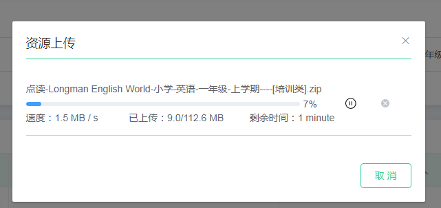

::: tip
vue大文件分片上传vue-simple-uploader使用

自定义组件的封装，默认样式修改

vue 插槽的使用
:::

## 文件上传介绍

关于小文件上传类似图片之类的，我们可以直接用很多ui框架封装的上传组件，或者自己写一个input 上传，利用FormData 对象提交文件数据，
但是对于比较大的文件，比如我的这个项目就要求在客户端上传2G左右的文件（难受，http那种），就需要将文件分片上传（file.slice()），否则中间http长时间连接可能会断掉。<br/>

我这里使用的是vue-simple-uploader，一个基于simple-uploader封装的上传插件，因此你需要先了解simple-uploader及vue-simple-uploader相关API<br/>
地址：<br/>
[simple-uploader:](https://github.com/simple-uploader/Uploader/blob/develop/README_zh-CN.md#)<br/>
[vue-simple-uploader](https://github.com/simple-uploader/vue-uploader)<br/>

默认样式：<br/>
<br/>

自定义样式：




## 相关API及配置介绍

在使用之前需要了解：
我们需要修改默认样式(我这里结合element-ui)，请先下载vue-uploader源码，查看源码方便我们使用插槽替换默认样式及使用它的相关方法

### 相关概念
chunkNumber: 当前块的次序，第一个块是 1，注意不是从 0 开始的。<br/>
totalChunks: 文件被分成块的总数。<br/>
chunkSize: 分块大小，根据 totalSize 和这个值你就可以计算出总共的块数。注意最后一块的大小可能会比这个要大。<br/>
currentChunkSize: 当前块的大小，实际大小。<br/>
totalSize: 文件总大小。<br/>
identifier: 这个就是每个文件的唯一标示。<br/>
filename: 文件名

### 相关方法
.upload() 开始或者继续上传。<br/>
.pause() 暂停上传。<br/>
.resume() 继续上传。<br/>
.cancel() 取消所有上传文件，文件会被移除掉。<br/>
.progress() 返回一个0-1的浮点数，当前上传进度。<br/>
.isUploading() 返回一个布尔值标示是否还有文件正在上传中。<br/>
.addFile(file) 添加一个原生的文件对象到上传列表中。<br/>
.removeFile(file) 从上传列表中移除一个指定的 Uploader.File 实例对象。<br/>

更多查看官方api文档 https://github.com/simple-uploader/Uploader/blob/develop/README_zh-CN.md#

## 组件封装

安装
npm install vue-simple-uploader --save

import Vue from 'vue'<br/>
import uploader from 'vue-simple-uploader'<br/>
Vue.use(uploader)

这里先贴出封装的代码：
```js
<template>
  <el-dialog
    custom-class="myUpLoad"
    title="资源上传"
    :visible.sync="dialogVisible"
    :close-on-click-modal="false"
    width="600px"
    :before-close="handleClose"
    @open="openDialog"
  >
    <div class="list_content" v-loading="isDisable" element-loading-text="资源解析中...">
      <uploader
        :options="options" //配置项
        :autoStart="false"
        ref="uploader"
        class="uploader-example"
        @file-added="onFileAdded" //绑定文件上传事件回调，下面会介绍
        @file-success="onFileSuccess"
        @file-progress="onFileProgress"
        @file-error="onFileError"
      >
        <uploader-unsupport></uploader-unsupport> //浏览器不支持将显示此内容

        <uploader-list>
          <template slot-scope="props">
            <ul>
              <li v-for="file in props.fileList" :key="file.id" class="liItem">
                <uploader-file :file="file" :list="true" ref="uploaderFile" :pauseFlag="pauseFlag">
                  <template slot-scope="props">//使用插槽替换组件默认样式
                    <div class="filebox">
                      <p class="fileNameBox">
                        <span class="fileIcon"></span>
                        {{file.name}}
                      </p>
                      <p class="fileProgressBox">
                        <el-progress
                          class="progressLength"
                          :percentage="parseInt((props.progress.toFixed(2))*100-1<0?0:(props.progress.toFixed(2))*100-1)"
                        ></el-progress>
                        <span
                          :class="{statusBtn:!pauseFlag,resumeBtn:pauseFlag}"
                          class="progressBtn"
                          @click="pause(file,file.resourceId)"
                        ></span>
                        <span class="cancelBtn progressBtn" @click="remove(file,file.resourceId)"></span>
                      </p>
                      <p class="fileInfoBox">
                        <span class="fileInfoItem">速度：{{pauseFlag? 0: props.formatedAverageSpeed}}</span>
                        <span
                          class="fileInfoItem"
                        >已上传：{{(parseFloat(props.formatedSize)*props.progress).toFixed(1)}}/{{props.formatedSize}}</span>
                        <span
                          class="fileInfoItem"
                        >剩余时间：{{pauseFlag? 0: props.formatedTimeRemaining}}</span>
                      </p>
                    </div>
                  </template>
                </uploader-file>
              </li>
            </ul>
          </template>
        </uploader-list>
        //开始上传按钮
        <uploader-btn ref="uploadBtn" id="global-uploader-btn" :attrs="attrs">添加</uploader-btn>
      </uploader>
    </div>
    <div slot="footer" class="dialog-footer upLoadFooter">
      <el-button plain size="medium" @click="cancelAddRes" class="el-button cancel_btn">取 消</el-button>
      <el-button
        :class="{none:isUploading}"
        size="medium"
        @click="continueAddRes"
        class="el-button continueAddRes_btn"
        id="continueAddRes_btn"
      >添加</el-button>
    </div>
  </el-dialog>
</template>
```

options配置及processParams参数
```js
<script>
var resourceId = "";//保存资源id
import SparkMD5 from "spark-md5";

export default {
  data() {
    return {
      //上传组件配置
      options: {
        target: UPLOAD,
        testChunks: false, //是否开启服务器分片校验
        maxChunkRetries: 5, //最大自动失败重试上传次数
        chunkSize: 3 * 1024 * 1024,//分片大小
        singleFile: true,//单文件上传
        simultaneousUploads: 1,

        processParams(params) {//每一次分片传给后台的参数，params是该方法返回的形参，包含分片信息
          return {//返回一个对象，会添加到每一个分片的请求参数里面
            name: params.filename,
            code: params.identifier,
            total: params.totalChunks,
            index: params.chunkNumber,
            resourceId,
          };
        }
      },

      attrs: {
        accept: ".zip"
      }
    };
  },

```
组件通信我采用的是bus管理，在挂载是监听，销毁时注销监听事件，当然你如果是父子通信就没有这么复杂
```js
  mounted() {
    //组件通信，需要监听开始上传，具体按自己业务决定  
    this.$root.Bus.$on("addResourceUpload", (params) => {
      this.dialogVisible = true;
    
      setTimeout(() => {
        //隐藏原来的上传按钮，模拟点击开始上传  
        document.querySelector("#global-uploader-btn").click();
      }, 50);
    });
  },
  destroyed() {
    this.$root.Bus.$off("addResourceUpload")
  },
```
文件上传各个阶段回调，下面几个回调一般都会用到
```js  
    //文件添加时回调，这里可以做格式校验，md5计算  
    onFileAdded(file) {
      let typeName = file.file.name;
      let reg = /\.zip$/;
      if (!reg.test(typeName)) {
        file.ignored = true;
        this.$alert("上传文件格式不正确，请检查", "上传错误", {
          confirmButtonText: "确定",
          callback: action => {
            
          }
        });
      } else {
          // 计算MD5;
          this.computeMD5(file);
        
      }
    },
    //所有分片上传完成的回调，需要注意的是，由于异步上传，每一次分片上传不会等上一次响应回来才发送，
    //因此该上传成功的回调时，返回的分片响应可能不是最后一片，因此后续会发送合并请求告诉后台进行合并文件
    onFileSuccess(rootFile, file, message, chunk) { 
          //所有分片上传成功，发送合并分片请求，具体参数与后台确定，后台合并文件
    },

    //文件上传的过程中会频繁调用该函数
    onFileProgress(rootFile, file, chunk) {},

    //文件上传出错的回调
    onFileError(rootFile, file, msg, chunk) { 
    }
  ```
计算Md5,生成唯一标识uniqueIdentifier
```js
    computeMD5(file) {
      let that = this;
      let fileReader = new FileReader();
      let md5 = "";
      file.pause();//先暂停，后续生成uniqueIdentifier
      fileReader.readAsArrayBuffer(file.file);

      fileReader.onload = e => {
        if (file.size != e.target.result.byteLength) {
          this.error("文件读取失败");
          return;
        }

        md5 = SparkMD5.hash(file.name);//业务需求以文件名作为加密
        file.uniqueIdentifier = md5;

        if (md5 != "") {
          file.resume();//继续上传文件
        }
      };

      fileReader.onerror = function() {
        this.error("文件读取失败");
      };
    },
```
uploader-list组件可以上传多个文件，多个file对象放在该组件里面上传，之前我是想做多个文件上传，发现浏览器较卡并且后台也不好处理，
于是就做单个大文件上传，单文件的话你可以不用uploader-list，直接使用uploader-file，我这里就不做修改了，uploader-file组件就是存放file对象的相关信息<br/>

vue-simple-uploader相关组件情况：<br/>


vue-simple-uploader源码 的uploader-file组件部分代码：
```js
<template>
  <div class="uploader-file" :status="status">
    <slot
      :file="file"
      :list="list"
      :status="status"
      :paused="paused"
      :error="error"
      :response="response"
      :average-speed="averageSpeed"
      :formated-average-speed="formatedAverageSpeed"
      :current-speed="currentSpeed"
      :is-complete="isComplete"
      :is-uploading="isUploading"
      :size="size"
      :formated-size="formatedSize"
      :uploaded-size="uploadedSize"
      :progress="progress"
      :progress-style="progressStyle"
      :progressing-class="progressingClass"
      :time-remaining="timeRemaining"
      :formated-time-remaining="formatedTimeRemaining"
      :type="type"
      :extension="extension"
      :file-category="fileCategory"
      >
      <div class="uploader-file-progress" :class="progressingClass" :style="progressStyle"></div>
      <div class="uploader-file-info">
        <div class="uploader-file-name"><i class="uploader-file-icon" :icon="fileCategory"></i>{{file.name}}</div>
        <div class="uploader-file-size">{{formatedSize}}</div>
        <div class="uploader-file-meta"></div>
        <div class="uploader-file-status">
          <span v-show="status !== 'uploading'">{{statusText}}</span>
          <span v-show="status === 'uploading'">
            <span>{{progressStyle.progress}}</span>
            <em>{{formatedAverageSpeed}}</em>
            <i>{{formatedTimeRemaining}}</i>
          </span>
        </div>
        <div class="uploader-file-actions">
          <span class="uploader-file-pause" @click="pause"></span>
          <span class="uploader-file-resume" @click="resume">️</span>
          <span class="uploader-file-retry" @click="retry"></span>
          <span class="uploader-file-remove" @click="remove"></span>
        </div>
      </div>
    </slot>
  </div>
</template>

<script>
  import Uploader from 'simple-uploader.js'
  import events from '../common/file-events'
  import { secondsToStr } from '../common/utils'

  const COMPONENT_NAME = 'uploader-file'

  export default {
    data () {
      return {
        response: null,
        paused: false,
        error: false,
        averageSpeed: 0,
        currentSpeed: 0,
        isComplete: false,
        isUploading: false,
        size: 0,
        formatedSize: '',
        uploadedSize: 0,
        progress: 0,
        timeRemaining: 0,
        type: '',
        extension: '',
        progressingClass: ''
      }
    } 
  }
</script>
```

## 插槽的使用、修改默认样式

修改默认样式之前推荐看一下vue-simple-uploader源码，方便后续修改操作，在这里我们需要使用插槽，替换掉uploader-file默认元素，这里使用slot，代码如下：

```js
<uploader-file :file="file" :list="true" ref="uploaderFile" :pauseFlag="pauseFlag">
    <template slot-scope="props">
        <div class="filebox">
            <p class="fileNameBox">
            <span class="fileIcon"></span>
            {{file.name}}
            </p>
            <p class="fileProgressBox">
            <el-progress
                class="progressLength"
                :percentage="parseInt((props.progress.toFixed(2))*100-1<0?0:(props.progress.toFixed(2))*100-1)"
            ></el-progress>
            <span
                :class="{statusBtn:!pauseFlag,resumeBtn:pauseFlag}"
                class="progressBtn"
                @click="pause(file,file.resourceId)"
            ></span>
            <span class="cancelBtn progressBtn" @click="remove(file,file.resourceId)"></span>
            </p>
            <p class="fileInfoBox">
            <span class="fileInfoItem">速度：{{pauseFlag? 0: props.formatedAverageSpeed}}</span>
            <span
                class="fileInfoItem"
            >已上传：{{(parseFloat(props.formatedSize)*props.progress).toFixed(1)}}/{{props.formatedSize}}</span>
            <span
                class="fileInfoItem"
            >剩余时间：{{pauseFlag? 0: props.formatedTimeRemaining}}</span>
            </p>
        </div>
    </template>
</uploader-file>

```                
 `<template slot-scope="props">` props可以获取到组件数据,比如props.formatedAverageSpeed获取格式化后的上传平均速度， 
 props.formatedTimeRemaining获取剩余时间等<br/>
具体样式代码我就不贴出来了，可以自行修改。


